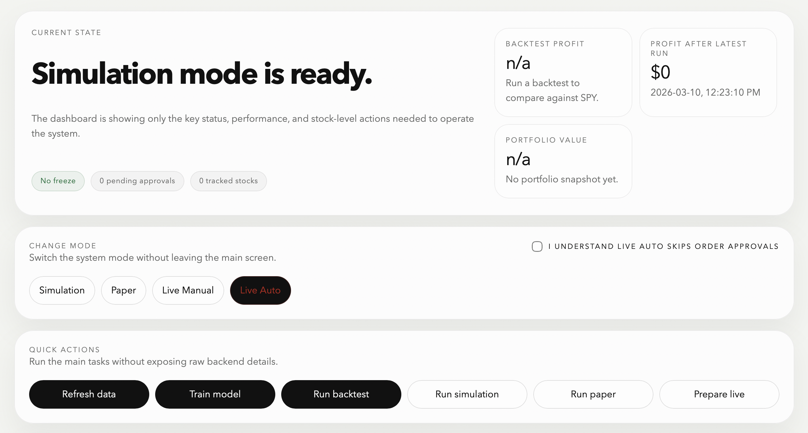

# Stock Trade Bot

Stock trading bot with a browser-based operator workspace for research, simulation, paper trading, and live operations.

<p align="center">
  
</p>

Stock Trade Bot packages the repository's documented local-first stock trading workflow into a single `stocktradebot` command. By default it prepares the runtime and opens the operator workspace in the browser, while the full direct command surface remains available for setup, data backfill, intraday research, backtesting, simulation, paper trading, and live runtime tasks.

## Quickstart

Install `pipx` and the package:

```bash
python3 -m pip install --user pipx
pipx ensurepath
pipx install stocktradebot
```

Published releases are shipped to PyPI by [publish-pypi.yml](/Users/rainzhang/StockTradeBot/.github/workflows/publish-pypi.yml). If you are preparing the first release, configure the PyPI Trusted Publisher described in [release-process.md](/Users/rainzhang/StockTradeBot/docs/release-process.md) before expecting `pipx install stocktradebot` to resolve from PyPI.

Open the app from anywhere in your terminal with:

```bash
stocktradebot
```

`stocktradebot` launches the local runtime and opens the operator workspace after the package is installed.

On first launch, `stocktradebot` creates the default application home under `~/.stocktradebot/`.

## Docs

- [Stock Trade Bot Documentation](docs/)
- [Commands](docs/commands.md)

This repository is licensed under the [MIT License](LICENSE).
